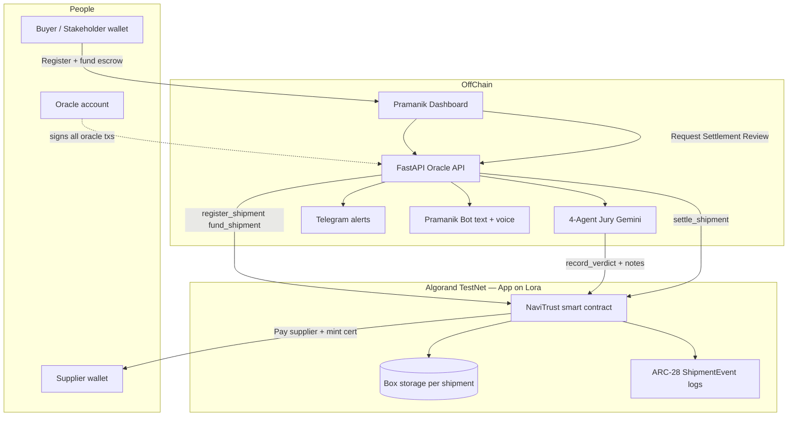
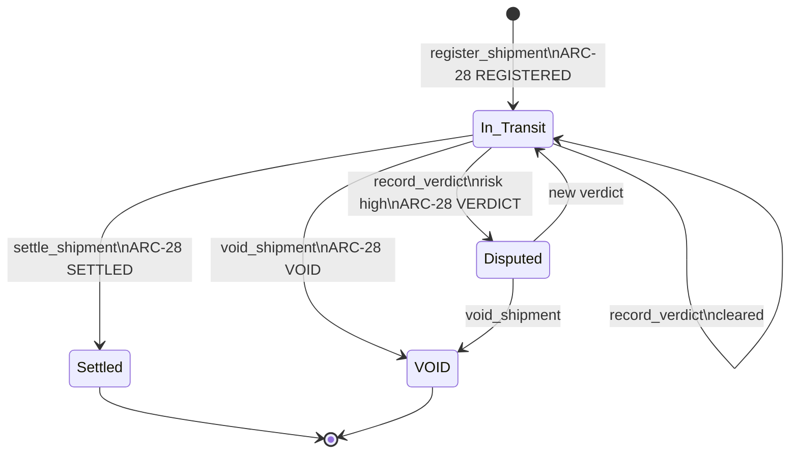
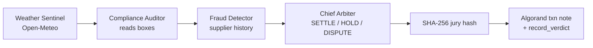
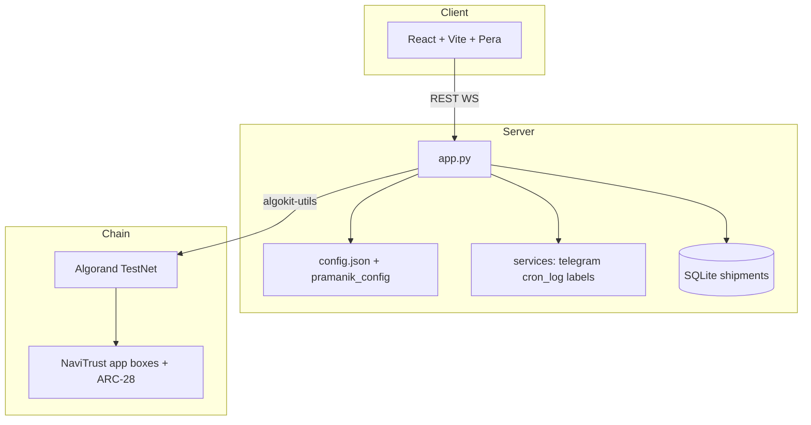

# Pramanik (प्रमाणिक) — Dispute Oracle for Indian Exporters

**Pramanik** means *verified* and *authentic*. An MSME exporter locks **ALGO escrow** on Algorand; a **four-agent AI jury** reviews weather, compliance, and fraud; the **oracle** writes an immutable verdict; escrow **releases or stays frozen**—with a **Settlement Certificate** you can open on [Lora](https://lora.algokit.io).

| | |
|---|---|
| **Dashboard** | React app in `frontend/` |
| **API** | FastAPI `app.py` |
| **Contract** | Puya app in `smart_contracts/navi_trust/` |
| **Config** | `config.json` + `.env` (no hardcoded App IDs in code) |

**Live app:** [pramanik.vercel.app](https://pramanik.vercel.app) · **Lora (current TestNet app):** [Application 759052600](https://lora.algokit.io/testnet/application/759052600)

---

## The story (60 seconds)

Rajesh in Mumbai ships cotton to Rotterdam. The buyer locks **2 ALGO** in a smart contract—not in Pramanik’s database. Mid-voyage, weather spikes near the port; the buyer hesitates to pay.

Instead of months of email dispute:

1. **Register** the corridor on-chain (oracle-signed).
2. **Fund** escrow from the buyer’s wallet (Pera).
3. **Request Settlement Review** — four AI agents run in sequence; a **SHA-256 jury hash** is anchored in a transaction note.
4. **Verdict** lands on-chain (`SETTLE`, `HOLD`, or dispute path).
5. **Release Payment** — supplier receives ALGO; a **PRAMANIK-CERT** ASA is minted in the same atomic flow.
6. Anyone can **Verify** the shipment at `/verify/{id}` without logging in.

Rajesh gets a **Telegram** message: *Mumbai → Rotterdam \| Cotton Fabric \| ≈ ₹5,900 escrow · Payment Released* — not a raw `PRM-EX-…` code.

That is the product narrative we built for **AlgoBharat**: trust-minimized escrow + explainable AI + public proofs.

---

## End-to-end flow



### Shipment lifecycle (on-chain)



### AI jury pipeline



---

## Why Lora shows the name **NaviTrust**

The **product** is **Pramanik**. The **on-chain application label** in Lora and ARC-56 metadata is still **NaviTrust** because that is the compiled Puya contract class name (`class NaviTrust` in `smart_contracts/navi_trust/contract.py`). Algorand explorers read that ABI name—it does not affect escrow logic or certificates (**PRAMANIK-CERT** / **PCERT** on settle).

| What you see | Name |
|--------------|------|
| Website, Telegram, UI | **Pramanik** |
| Lora application title | **NaviTrust** (contract class) |
| Settlement NFT | **PRAMANIK-CERT** |

To rename the Lora app to “Pramanik” you would redeploy with a renamed contract class and update `APP_ID` everywhere—a planned v2, not required for demos.

**Open logs:** [lora.algokit.io/testnet/application/759052600](https://lora.algokit.io/testnet/application/759052600) → **Logs** tab → `ShipmentEvent` (REGISTERED, FUNDED, VERDICT, SETTLED, VOID).

---

## What to fund (TestNet)

| Account | Who | How much | Why |
|---------|-----|----------|-----|
| **Oracle** (`ORACLE_MNEMONIC`) | You, via faucet | **≥ 5 ALGO** recommended | Registers lanes, runs jury, settles, pays fees |
| **Buyer wallet** | Demo stakeholder (Pera) | **≥ 1 ALGO** per fund click | Locks escrow into contract (`fund_shipment`) |
| **Contract app** | Auto on deploy | **~0.5 ALGO** | Box MBR + opcode budget (`full_deploy.py` funds this) |

**Faucet:** https://bank.testnet.algorand.network/  
Paste the address from API startup: `Oracle: GUZQQLW…`

Copy `.env.example` → `.env` and set:

```env
ORACLE_MNEMONIC=your 25 words
APP_ID=759052600
GEMINI_API_KEY=...
SEED_MIN_ORACLE_MICRO=2000000
```

Frontend: `cp frontend/.env.example frontend/.env` — set `VITE_APP_ID` to the same `APP_ID`.

---

## Quick start

```powershell
# 1. Config
copy .env.example .env
# edit .env — ORACLE_MNEMONIC, GEMINI_API_KEY, APP_ID

copy frontend\.env.example frontend\.env

# 2. Backend
pip install -r requirements.txt
python -m uvicorn app:app --reload

# 3. Frontend (new terminal)
cd frontend
npm install
npm run dev
```

Open **http://127.0.0.1:5173** · API docs **http://127.0.0.1:8000/docs**

### Optional: fresh deploy + seed

```powershell
# Needs ≥ 2 ALGO on oracle
python scripts/full_deploy.py

# Or seed existing APP_ID (needs ≥ SEED_MIN_ORACLE_MICRO on oracle)
python seed_blockchain.py
```

### Smoke tests

```powershell
python scripts/test_telegram.py
python scripts/test_elevenlabs.py
pytest tests/unit -q
```

---

## Architecture (layers)



| Layer | Key files |
|-------|-----------|
| Contract | `smart_contracts/navi_trust/contract.py` |
| Chain client | `algorand_client.py` |
| API | `app.py` |
| Config | `config.json`, `pramanik_config.py` |
| UI | `frontend/src/App.tsx` |
| Deploy | `scripts/full_deploy.py`, `deploy.sh` |

Deeper builder narrative: **[BUILDERS.md](./BUILDERS.md)** · On-chain proof checklist: **[LORA_PROOF.md](./LORA_PROOF.md)**

---

## Features map

| Feature | Endpoint / route |
|---------|------------------|
| Public verify | `GET /verify/{shipment_id}` |
| Run jury | `POST /run-jury` |
| Register | `POST /register-shipment` |
| Void (oracle) | `POST /void/{shipment_id}` |
| Export CSV | `GET /export/shipments.csv` |
| Live feed | WebSocket `/ws/live` |
| Auto-jury log | `GET /cron-log` |
| Pramanik Bot | `/pramanik-bot` + `POST /navibot` |
| ElevenLabs | `GET /elevenlabs/config` |
| Telegram test | `POST /admin/test-telegram` |

---

## Demo lanes (`config.json`)

| ID | Human label |
|----|-------------|
| PRM-EX-MUM-RDM-001 | Mumbai → Rotterdam \| Cotton Fabric |
| PRM-EX-CHN-SGP-002 | Chennai → Singapore \| Spices |
| PRM-EX-DEL-DXB-003 | Delhi → Dubai \| Electronics |

---

## Deploy frontend (Vercel)

- Root or `frontend/` — set **`VITE_API_URL`** to your FastAPI host (no trailing slash).
- **`VITE_APP_ID`** = same as backend `APP_ID`.
- Add Vercel origin to **`CORS_EXTRA_ORIGINS`** on the API.

---

## Tech stack

- **Algorand:** TestNet, AlgoKit, Puya, ARC-56, ARC-28 events, ARC-69 certificates  
- **AI:** Google Gemini (`google-genai`)  
- **Backend:** FastAPI, SQLite, APScheduler (auto-jury)  
- **Frontend:** React 18, TypeScript, Vite, TanStack Query, Pera Wallet  
- **Integrations:** Telegram, ElevenLabs ConvAI, Open-Meteo, CoinGecko  

---

## Repo hygiene

Do **not** commit: `.env`, `frontend/.env`, `*.db`, `cron_log.json`, `__pycache__/`, `frontend/dist/`.  
Templates: `.env.example`, `frontend/.env.example`.

---

*Built for AlgoBharat — Pramanik product, NaviTrust on-chain contract name.*
