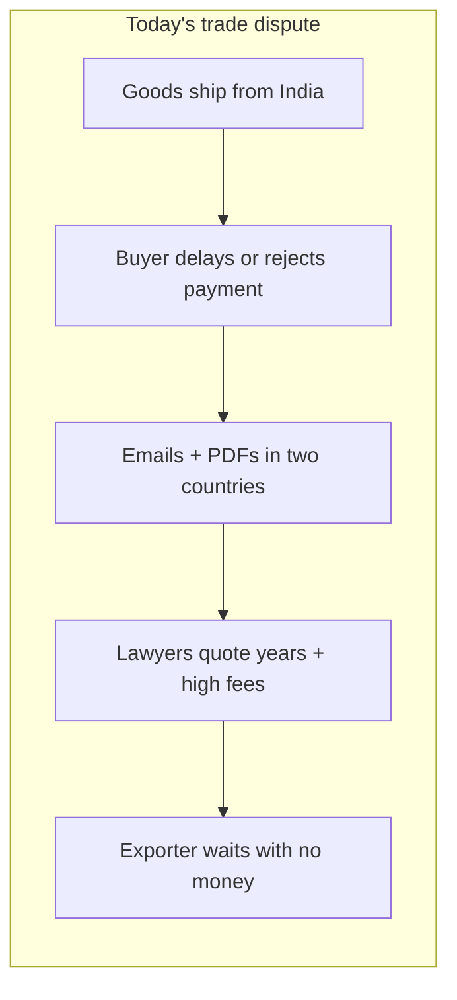
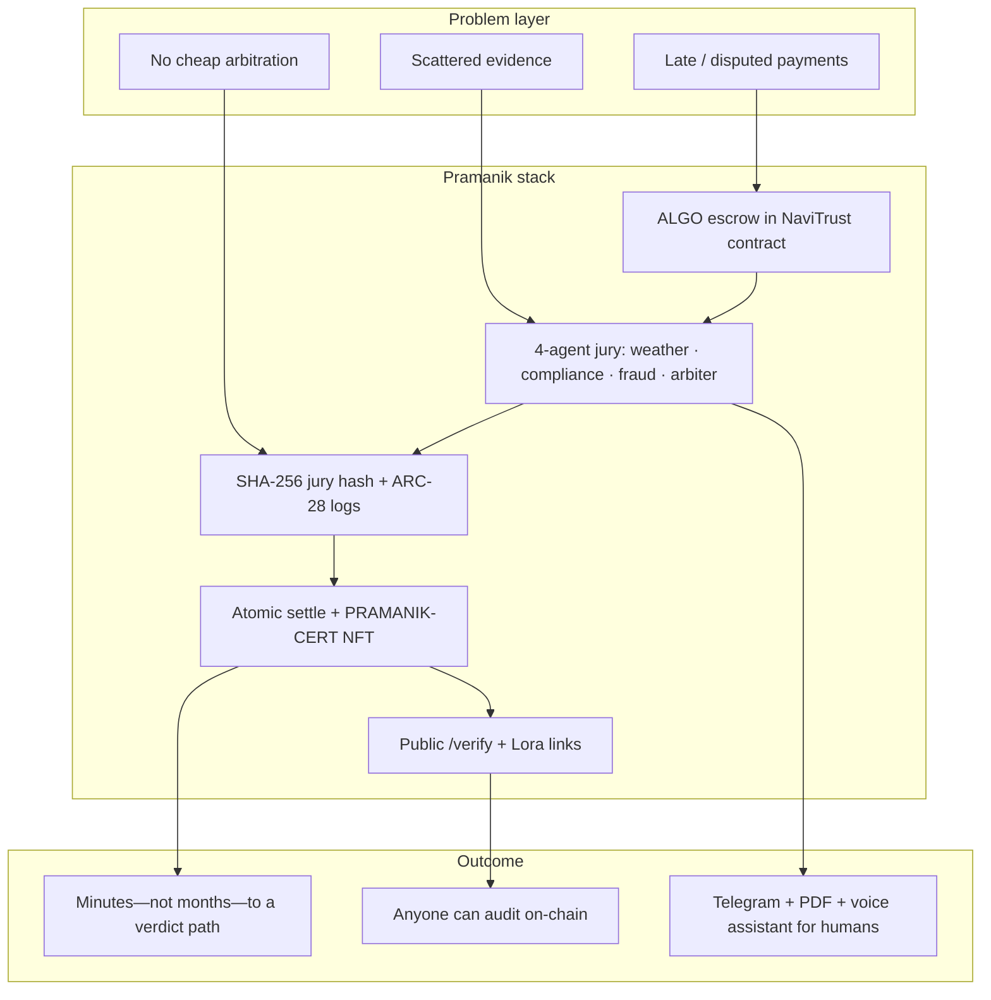
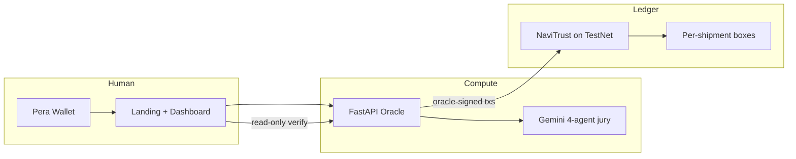
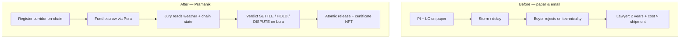
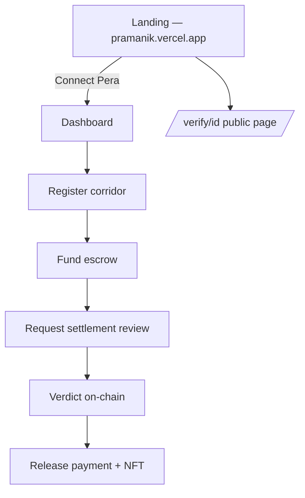
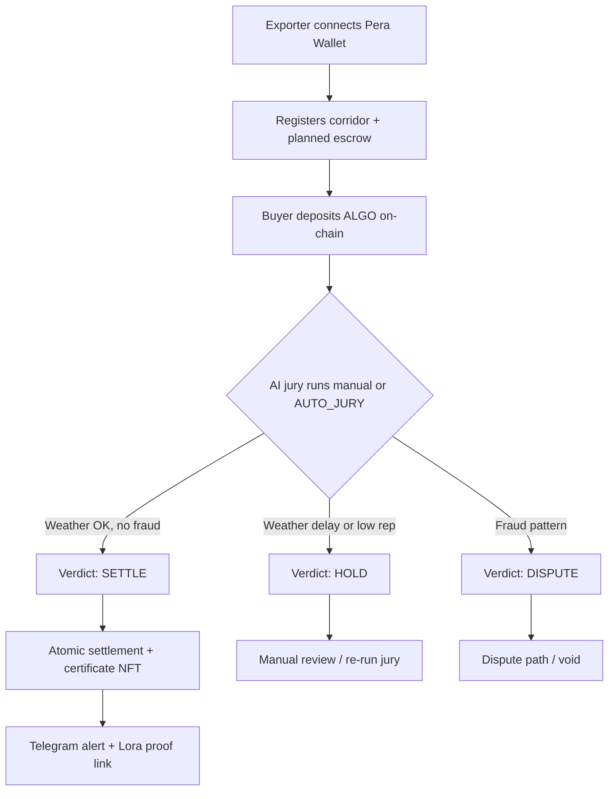
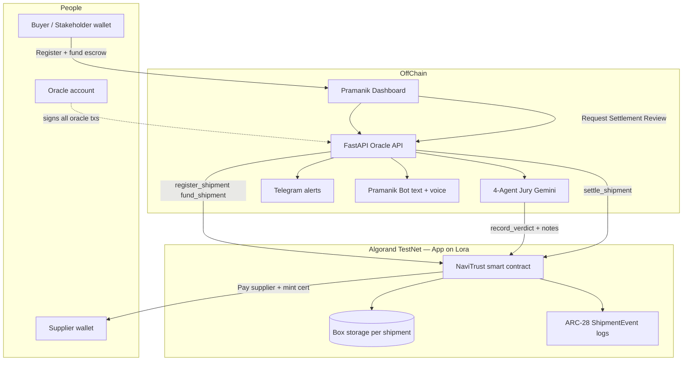
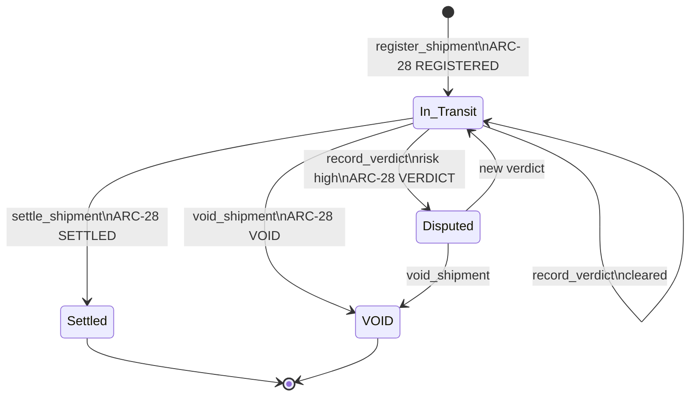
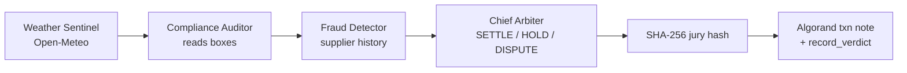
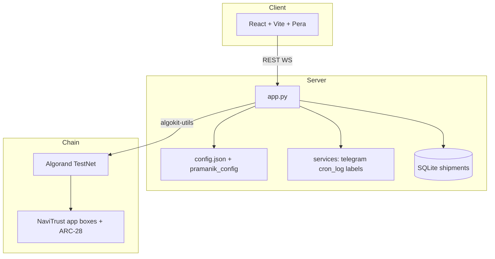

# Pramanik (प्रमाणिक) — Dispute Oracle for Indian Exporters

**Pramanik** means *verified* and *authentic*. An MSME exporter locks **ALGO escrow** on Algorand; a **four-agent AI jury** reviews weather, compliance, and fraud; the **oracle** writes an immutable verdict; escrow **releases or stays frozen**—with a **Settlement Certificate** you can open on [Lora](https://lora.algokit.io).

| | |
|---|---|
| **Dashboard** | React app in `frontend/` |
| **API** | FastAPI `app.py` |
| **Contract** | Puya app in `smart_contracts/navi_trust/` |
| **Config** | `config.json` + `.env` (no hardcoded App IDs in code) |

**Live app:** [pramanik.vercel.app](https://pramanik.vercel.app) · **Lora (TestNet):** [Application 759052600](https://lora.algokit.io/testnet/application/759052600)

---

## Table of contents

- [The problem](#the-problem)
- [Our solution](#our-solution)
- [The story](#the-story-60-seconds)
- [Before vs after Pramanik](#before-vs-after-pramanik)
- [Landing page](#landing-page)
- [What you can demo in 5 minutes](#what-you-can-demo-in-5-minutes)
- [User roles](#user-roles)
- [End-to-end flow](#end-to-end-flow)
- [AI jury pipeline](#ai-jury-pipeline)
- [Weather, disputes & trade rules](#weather-disputes--trade-rules)
- [Why Lora shows NaviTrust](#why-lora-shows-the-name-navitrust)
- [What to fund (TestNet)](#what-to-fund-testnet)
- [Quick start](#quick-start)
- [Environment variables](#environment-variables)
- [Project structure](#project-structure)
- [API reference](#api-reference)
- [Testing](#testing)
- [Deploy](#deploy)
- [Troubleshooting](#troubleshooting)
- [Tech stack](#tech-stack)
- [Further reading](#further-reading)

---

## The problem

Indian MSME exporters ship goods worth billions every year—and **payment disputes** routinely turn into **months of delay**, **legal cost**, and **cash-flow collapse**. The pain is structural, not anecdotal.

| Reality today | Impact on exporters |
|---------------|---------------------|
| **₹7.34 lakh crore** in delayed / disputed MSME payments annually (India) | Working capital trapped |
| **45+ days** past due before many exporters see payment | Payroll and raw-material stress |
| **~12%** of MSMEs cite cash-flow crises from late payment as a shutdown driver | Jobs at risk |
| **Commercial arbitration** priced for large corporates | Small shippers have **no affordable, fast path** |

### Why disputes get stuck



**Root causes:** escrow lives in **trust**, not **code**; evidence is **scattered** (customs, weather, AIS); nobody has a **single verifiable record** both sides and a judge can audit tomorrow.

### Who feels it

- **Exporter / supplier** — ships first, gets paid last; force-majeure claims without proof lose by default.
- **Buyer / stakeholder** — wants protection, but opaque processes breed more disputes.
- **Banks & insurers** — lack machine-readable, on-chain anchors for automated release rules.

Pramanik does **not** replace courts or Incoterms lawyers. It **anchors escrow and jury outcomes** on Algorand with **public verification**—so the fight moves from inbox chaos to **provable state**.

---

## Our solution

**Pramanik** = **verified escrow** + **four-agent AI jury** + **immutable Algorand proofs** (Lora, transaction notes, settlement NFT).



| Pillar | What it does | Where it lives |
|--------|----------------|----------------|
| **Trustless escrow** | Buyer locks ALGO; contract holds until verdict | `fund_shipment` · boxes `fn_` / `st_` |
| **Explainable jury** | Weather (Open-Meteo), compliance, fraud, chief arbiter | `app.py` jury pipeline · Gemini + fallbacks |
| **Permanent proof** | JSON txn notes, jury hash, ARC-28 `ShipmentEvent`, certificate ASA | Lora · `/verify/{id}` · PDF export |

### Solution architecture (one screen)



---

## The story (60 seconds)

**Ramesh**, a textile exporter in Surat, shipped to Rotterdam. The buyer claimed **force majeure** after a Bay-of-Bengal delay. Ramesh had weather bulletins and customs entries—but **no fast forum** that would read them. *"The buyer claimed force majeure. I had no proof. I had no money."*

With **Pramanik**, the next corridor works differently: the buyer locks **2 ALGO** in a smart contract—not in a spreadsheet. Mid-voyage, weather spikes near Rotterdam; instead of months of email:

1. **Register** the corridor on-chain (oracle-signed).
2. **Fund** escrow from the buyer’s **Pera Wallet**.
3. **Request Settlement Review** — four AI agents run in sequence; a **SHA-256 jury hash** is anchored in a transaction note.
4. **Verdict** lands on-chain (`SETTLE`, `HOLD`, or `DISPUTE`).
5. **Release payment** — supplier receives ALGO; a **PRAMANIK-CERT** ASA is minted in the same atomic flow.
6. Anyone can **verify** at `/verify/{shipment_id}` without logging in.

Rajesh gets a **Telegram** alert with route, planned escrow in ALGO, and a **Lora transaction link**—not a raw internal ID.

That is the product narrative for **AlgoBharat**: trust-minimized escrow + explainable AI + public proofs.

---

## Before vs after Pramanik



| Stage | Traditional | Pramanik |
|-------|-------------|----------|
| Escrow | Trust / bank delay | **Smart contract** holds ALGO |
| Evidence | PDFs, calls | **Open-Meteo + boxes + hash** |
| Decision | Court / arbitration | **4-agent jury** + oracle `record_verdict` |
| Proof | None portable | **Lora tx + `/verify` + PDF** |
| Time | Months–years | **Demo path: minutes** (TestNet) |

---

## Landing page

The public marketing site matches the local **`pramanik-landing`** design (cream `#FAF8F4`, terracotta `#C17435`, Playfair + Inter):

- **Hero** — `msme_owner.png`, Surat exporter quote card  
- **Problem** — story acts + `port_golden.png` / `dispute_documents.png`  
- **Solution** — five-step timeline + `trust.png`  
- **SDG** — goals 8, 9, 10  
- **On-chain proof** — live verdict panel + Lora CTA  
- **Connect wallet** → dashboard (no separate login wall)

Implementation: `frontend/src/components/landing/original/` + `pramanik-landing.css` · assets in `frontend/public/images/`.



### How it works (demo flow)



**Lora note:** The on-chain contract class is named **NaviTrust** in ARC-56; the product brand is **Pramanik**. Same bytecode, different labels in the explorer vs the UI.

---

## What you can demo in 5 minutes

| Step | Who | What happens | Proof |
|------|-----|--------------|-------|
| 1 | Anyone | Open `/verify/PRM-EX-MUM-RDM-001` (or a lane you registered) | Public API + on-chain boxes |
| 2 | Stakeholder | Connect **Pera** → register corridor → **Deposit ALGO** | Registration tx + fund tx on Lora |
| 3 | Stakeholder | **Request Settlement Review** on a corridor card | Jury runs; verdict tx + hash |
| 4 | Stakeholder | **Release payment** if verdict is SETTLE | Settle tx + certificate ASA |
| 5 | Anyone | **Download certificate PDF** or executive PDF | `GET /shipments/{id}/pdf` |
| 6 | Anyone | Open **Transaction history** | Latest-first ledger feed + Lora links |

**Health check:** `GET http://127.0.0.1:8000/health` → `"status": "ok"`, `algod_ok`, `oracle_ready_for_writes`.

---

## User roles

| Role | Wallet | Typical actions |
|------|--------|-----------------|
| **Stakeholder / buyer** | Pera (TestNet) | Register corridor, fund escrow, request jury, release payment |
| **Supplier / exporter** | Pera (TestNet) | View incoming payments, trust score, mint exporter certificate (ASA) |
| **Oracle** | Server `ORACLE_MNEMONIC` | Signs `register_shipment`, `record_verdict`, `settle_shipment`, `void_shipment` |
| **Public verifier** | None | `GET /verify/{id}`, hash check, Lora links |

Registration requires **Pera connected first**—the UI blocks the form until the wallet is verified so escrow always has a real funder path.

---

## End-to-end flow



### Shipment lifecycle (on-chain)



### AI jury pipeline



| Agent | Input | Output |
|-------|--------|--------|
| **Weather Sentinel** | Destination coords, Open-Meteo | Precipitation, wind, risk framing |
| **Compliance Auditor** | On-chain boxes, route, incoterm context | Document / policy alignment score |
| **Fraud Detector** | Supplier reputation box, history | Anomaly / trust signals |
| **Chief Arbiter** | Prior agent outputs | `SETTLE`, `HOLD`, or `DISPUTE` + narrative |

Gemini powers the pipeline when `GEMINI_API_KEY` is set; deterministic fallbacks keep demos running if the API is slow or unavailable.

---

## Weather, disputes & trade rules

The dashboard includes a **Trade rules** panel (Incoterms table + force majeure + UN links). In plain language:

| Situation | Escrow behavior |
|-----------|-----------------|
| **Normal transit** | Funds locked until jury recommends release |
| **Weather / port delay** | Often **HOLD** until weather signals and documents are reviewed |
| **High risk / fraud signal** | **DISPUTE** — escrow frozen; void or re-jury paths |
| **SETTLE verdict** | Oracle calls `settle_shipment` — supplier paid + certificate NFT |

**Legal references (external):**

- [UN CISG](https://uncitral.un.org/en/texts/salegoods/conventions/sale_of_goods/cisg) — international sale of goods
- [UNCITRAL transport instruments](https://uncitral.un.org/en/texts/transport)
- [ICC Incoterms 2020](https://iccwbo.org/business-solutions/incoterms-rules/incoterms-2020/) — when risk transfers (FOB, CIF, DDP, etc.)

Pramanik does not replace legal counsel; it **anchors** escrow and jury outcomes on-chain with verifiable links.

---

## Why Lora shows the name **NaviTrust**

The **product** is **Pramanik**. The **on-chain application label** in Lora and ARC-56 metadata is still **NaviTrust** because that is the compiled Puya contract class name (`class NaviTrust` in `smart_contracts/navi_trust/contract.py`).

| What you see | Name |
|--------------|------|
| Website, Telegram, UI | **Pramanik** |
| Lora application title | **NaviTrust** (contract class) |
| Settlement NFT | **PRAMANIK-CERT** / **PCERT** |

**Open logs:** [Lora app 759052600](https://lora.algokit.io/testnet/application/759052600) → **Logs** → `ShipmentEvent` (`REGISTERED`, `FUNDED`, `VERDICT`, `SETTLED`, `VOID`).

---

## What to fund (TestNet)

| Account | Who | How much | Why |
|---------|-----|----------|-----|
| **Oracle** (`ORACLE_MNEMONIC`) | You, via faucet | **≥ 5 ALGO** recommended | Registers lanes, runs jury, settles, pays fees |
| **Buyer wallet** | Demo stakeholder (Pera) | **≥ 1 ALGO** per fund | Locks escrow (`fund_shipment`) |
| **Contract app** | Auto on deploy | **~0.5 ALGO** | Box MBR + NFT mint budget |

**Faucet:** https://bank.testnet.algorand.network/  
Use the **public address** from `ORACLE_ADDRESS` or `/health` — never paste the 25-word mnemonic into the faucet.

After funding:

```powershell
python seed_blockchain.py
```

---

## Quick start

```powershell
# 1. Config (repo root)
copy .env.example .env
# Edit: ORACLE_MNEMONIC, GEMINI_API_KEY, APP_ID

copy frontend\.env.example frontend\.env
# Edit: VITE_API_URL, VITE_APP_ID (same APP_ID)

# 2. Backend
pip install -r requirements.txt
python -m uvicorn app:app --reload --host 127.0.0.1 --port 8000

# 3. Frontend (new terminal)
cd frontend
npm install
npm run dev
```

| URL | Purpose |
|-----|---------|
| http://127.0.0.1:5173 | Dashboard (Vite proxies `/api` → backend in dev) |
| http://127.0.0.1:8000/docs | OpenAPI / Swagger |
| http://127.0.0.1:8000/health | Oracle + algod + indexer status |

### Optional: fresh deploy + seed

```powershell
# Needs ≥ 2 ALGO on oracle
python scripts/full_deploy.py

# Seed demo lanes on existing APP_ID
python seed_blockchain.py
```

### One-command API smoke test

```powershell
python scripts/e2e_test.py
```

Registers a test shipment, runs jury, checks PDF, timeline order, WebSocket, and CSV export against `http://127.0.0.1:8000`.

---

## Environment variables

### Backend (`.env`)

| Variable | Required | Description |
|----------|----------|-------------|
| `ORACLE_MNEMONIC` | Yes | 25-word oracle account (signs chain writes) |
| `APP_ID` | Yes | Deployed NaviTrust application ID |
| `GEMINI_API_KEY` | Yes* | AI jury (*fallbacks exist but quality drops) |
| `ALGOD_ADDRESS` / `INDEXER_URL` | No | Defaults to public TestNet nodes |
| `TELEGRAM_BOT_TOKEN` / `TELEGRAM_CHAT_IDS` | No | Registration, verdict, settlement alerts |
| `ELEVENLABS_API_KEY` / `ELEVENLABS_AGENT_ID` | No | Voice tab in floating assistant |
| `AUTO_JURY_ENABLED` | No | `1` = scheduled jury on in-transit shipments |
| `AUTO_SEED_DEMO` | No | `1` = seed lanes on startup |
| `SEED_MIN_ORACLE_MICRO` | No | Minimum oracle balance before seed (default 2 ALGO) |
| `CORS_EXTRA_ORIGINS` | No | Extra frontend origins (e.g. Vercel preview URL) |

See [`.env.example`](./.env.example) for the full list.

### Frontend (`frontend/.env`)

| Variable | Description |
|----------|-------------|
| `VITE_API_URL` | Backend base URL (no trailing slash) |
| `VITE_APP_ID` | Same as backend `APP_ID` |
| `VITE_ALGORAND_NETWORK` | `testnet` |
| `VITE_LORA_BASE_URL` | `https://lora.algokit.io/testnet` |

---

## Project structure

```
algo-hack/
├── app.py                 # FastAPI oracle API
├── algorand_client.py     # Chain reads/writes, Lora URLs, indexer
├── models.py              # Pydantic request bodies
├── hash_utils.py          # Canonical jury SHA-256
├── pramanik_config.py     # Thresholds, feature flags
├── config.json            # Demo lanes, commodity types
├── seed_blockchain.py     # TestNet demo seeding
├── services/
│   ├── telegram_service.py
│   └── shipment_pdf.py    # ReportLab certificates
├── smart_contracts/navi_trust/
│   └── contract.py        # Puya NaviTrust contract
├── frontend/              # React + Vite + Pera
├── scripts/
│   ├── e2e_test.py        # API end-to-end smoke test
│   ├── full_deploy.py
│   └── health_check.sh
├── tests/                 # pytest unit + integration
├── BUILDERS.md            # Vision & engineering narrative
├── LORA_PROOF.md          # Explorer verification checklist
└── ARCHITECTURE.md        # Pointer to docs above
```

---

## API reference

### Core shipment flow

| Method | Path | Description |
|--------|------|-------------|
| `POST` | `/register-shipment` | Oracle-signed registration (`planned_escrow_algo` in body) |
| `POST` | `/fund-shipment/build` | Unsigned txn group for Pera to fund escrow |
| `POST` | `/run-jury` | Four-agent jury + `record_verdict` on chain |
| `POST` | `/settle` | `settle_shipment` — returns `nft_asset_id`, `nft_lora_url` |
| `POST` | `/void/{shipment_id}` | Oracle void + refund path |
| `GET` | `/shipments` | All corridors (merged chain + SQLite) |
| `GET` | `/shipment/{shipment_id}` | Single shipment detail |
| `GET` | `/stats` | Global counters + escrow totals |

### Verification & exports

| Method | Path | Description |
|--------|------|-------------|
| `GET` | `/verify/{shipment_id}` | Public verification (no auth) |
| `POST` | `/verify-hash` | Recompute and match jury hash |
| `GET` | `/shipments/{id}/pdf` | Settlement certificate PDF |
| `GET` | `/shipments/{id}/timeline` | On-chain events (newest first) |
| `GET` | `/export/shipments.csv` | CSV export |
| `GET` | `/transactions` | Recent app txs (newest first) |

### Integrations

| Method | Path | Description |
|--------|------|-------------|
| `GET` | `/health` | algod, indexer, oracle, Gemini status |
| `GET` | `/config` | `app_id`, demo shipments, commodity types |
| `GET` | `/price` | ALGO spot (USD / INR hints) |
| `WS` | `/ws/live` | Live transaction feed |
| `POST` | `/navibot` | Text assistant (Gemini + rules) |
| `GET` | `/elevenlabs/config` | Voice agent id for widget |
| `POST` | `/admin/test-telegram` | Ping Telegram integration |
| `GET` | `/cron-log` | Auto-jury run history |
| `GET` | `/dispute-feed` | Verdict + dispute stream for UI |

Interactive docs: **http://127.0.0.1:8000/docs**

---

## Testing

```powershell
# Unit tests (fast, no chain)
pytest tests/unit -q

# Integration (may hit TestNet — needs APP_ID + oracle)
pytest tests/integration -q -m testnet

# Scripted API E2E (register → jury → PDF → WS)
python scripts/e2e_test.py

# Makefile shortcuts
make test-unit
make test-e2e
```

Optional integrations:

```powershell
python scripts/test_telegram.py
python scripts/test_elevenlabs.py
```

---

## Deploy (Vercel + Render)

**Full step-by-step guide:** **[HOSTING.md](./HOSTING.md)**

### Quick overview

| Step | Platform | What you deploy |
|------|----------|-----------------|
| 1 | **Render** | `app.py` (FastAPI) — set `ORACLE_MNEMONIC`, `GEMINI_API_KEY`, `APP_ID` |
| 2 | **Vercel** | `frontend/` — set `VITE_API_URL` to your Render URL |
| 3 | **Render again** | Set `CORS_EXTRA_ORIGINS` + `VERIFY_PUBLIC_BASE_URL` to your Vercel URL, redeploy |

**Render:** Use [`render.yaml`](./render.yaml) (Blueprint) or manual Web Service — health check `/health`, start command:

```bash
uvicorn app:app --host 0.0.0.0 --port $PORT --workers 1
```

**Vercel:** Import repo (root [`vercel.json`](./vercel.json) builds `frontend/dist`). Required build env:

```
VITE_API_URL=https://YOUR-SERVICE.onrender.com
VITE_APP_ID=759052600
```

**Verify after deploy:**

```powershell
curl https://YOUR-SERVICE.onrender.com/health
# Open https://YOUR-APP.vercel.app
```

### Contract (only if redeploying chain)

```powershell
python scripts/full_deploy.py
# Update APP_ID everywhere, then redeploy Render + Vercel
```

---

## Troubleshooting

| Symptom | Likely cause | Fix |
|---------|--------------|-----|
| `Port 8000 already in use` | Old uvicorn still running | Stop the process on 8000, restart API |
| Registration works but escrow 0 in Telegram | Escrow not funded yet | Telegram shows **planned** ALGO; fund via Pera on corridor card |
| Jury button disabled | Shipment not funded / wrong stage | Deposit ALGO first; check `/verify/{id}` status |
| Settle fails / no NFT | Low app account balance | Oracle auto-tops app for MBR; send 0.5 ALGO to contract app on Lora |
| Blank dashboard panels on refresh | Old loading pattern | Hard refresh; panels use stale-while-revalidate |
| CORS error from Vercel | API allowlist | Set `CORS_EXTRA_ORIGINS=https://your-app.vercel.app` |
| Gemini generic replies | Missing or invalid API key | Set `GEMINI_API_KEY`, restart API |
| Lora shows **NaviTrust** | Contract class name | Expected — see [Why Lora shows NaviTrust](#why-lora-shows-the-name-navitrust) |

**Windows:** Use `;` instead of `&&` in PowerShell, or run commands on separate lines.

---

## Architecture (layers)



| Layer | Key files |
|-------|-----------|
| Contract | `smart_contracts/navi_trust/contract.py` |
| Chain client | `algorand_client.py` |
| API | `app.py` |
| Config | `config.json`, `pramanik_config.py` |
| UI | `frontend/src/App.tsx` |
| Deploy | `scripts/full_deploy.py`, `deploy.sh` |

---

## Demo lanes (`config.json`)

| ID | Human label |
|----|-------------|
| PRM-EX-MUM-RDM-001 | Mumbai → Rotterdam \| Cotton Fabric |
| PRM-EX-CHN-SGP-002 | Chennai → Singapore \| Spices |
| PRM-EX-DEL-DXB-003 | Delhi → Dubai \| Electronics |

---

## Tech stack

- **Algorand:** TestNet, AlgoKit, Puya, ARC-56, ARC-28 `ShipmentEvent`, ARC-69 certificates
- **AI:** Google Gemini (`google-genai`) with deterministic fallbacks
- **Backend:** FastAPI, SQLite, APScheduler (auto-jury), ReportLab (PDF)
- **Frontend:** React 18, TypeScript, Vite, TanStack Query, Pera Wallet, Recharts
- **Integrations:** Telegram, ElevenLabs ConvAI, Open-Meteo, CoinGecko

---

## Further reading

| Doc | Contents |
|-----|----------|
| [HOSTING.md](./HOSTING.md) | **Vercel + Render deploy steps** (start here for production) |
| [BUILDERS.md](./BUILDERS.md) | Vision, box prefixes, why Algorand, engineering choices |
| [LORA_PROOF.md](./LORA_PROOF.md) | Step-by-step Lora verification for judges |
| [ARCHITECTURE.md](./ARCHITECTURE.md) | Short pointer to README + BUILDERS |
| [AGENTS.md](./AGENTS.md) | Cursor / Algorand agent workflow for contributors |

---

## Repo hygiene

Do **not** commit:

- `.env`, `frontend/.env` (use `.env.example` templates)
- `*.db`, `audit_trail.json`, `cron_log.json`
- `__pycache__/`, `node_modules/`, `frontend/dist/`
- `test_certificate_*.pdf` (E2E artifacts)

---

## Acknowledgments

Built for **AlgoBharat** — demonstrating how Indian MSME exporters can combine **Algorand escrow**, **multi-agent AI**, and **public verification** without trusting a black-box database.

**Pramanik** on the surface · **NaviTrust** on the chain · **Proof** on Lora.
